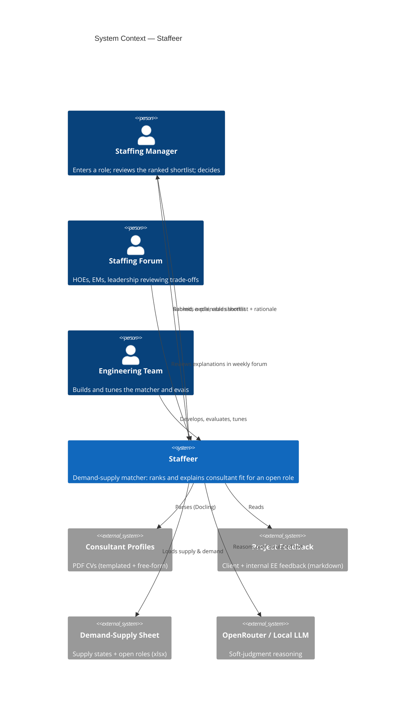

# L1 — System Context

> **Canonical model:** the architecture is defined in LikeC4 at `docs/architecture/model.staffeer.c4` (views `context` / `containers`). The Mermaid diagram below is a rendered mirror — keep it in sync with the `.c4` model when the architecture changes (see `docs/rules/likec4.md`).

Staffeer in its environment: who uses it, what it depends on, and what flows in and out.

## Users & roles

- **Staffing Manager (primary).** Enters an open role (or picks one from the sheet) and
  receives a ranked, explainable shortlist of consultants. Makes the final call — Staffeer
  advises, it does not decide.
- **HOEs / EMs / Leadership (forum).** Consume the explanations and trade-offs during the
  weekly staffing forum; rely on referenceable rationale to challenge or accept a match.
- **Engineering team (2-5).** Builds and tunes the system; authors evals; adjusts scoring
  weights and supply states as the business learns.

## External systems & inputs

- **Consultant profiles** (`profiles/*.pdf`) — 50 CVs, mixed templated and free-form.
- **Project & client feedback** (`project_feedback/*.md`) — per-consultant performance signal.
- **Supply & demand** (`demand-supply.xlsx`) — beach / rolling-off / new joiners, and the
  live list of open roles, one tab each.
- **OpenRouter** — hosted LLM access for soft-judgment reasoning (or a local model).
- These inputs are dynamic: bench, joiners, and roles all change continuously (~5%/mo growth),
  so Staffeer treats every run as a fresh snapshot.

## Trust & governance boundary

PII in profiles and feedback is scrubbed (Presidio + spaCy) **before** any text crosses the
boundary to the external LLM. Raw data never leaves the local environment unscrubbed, and is
git-ignored.

## Diagram

