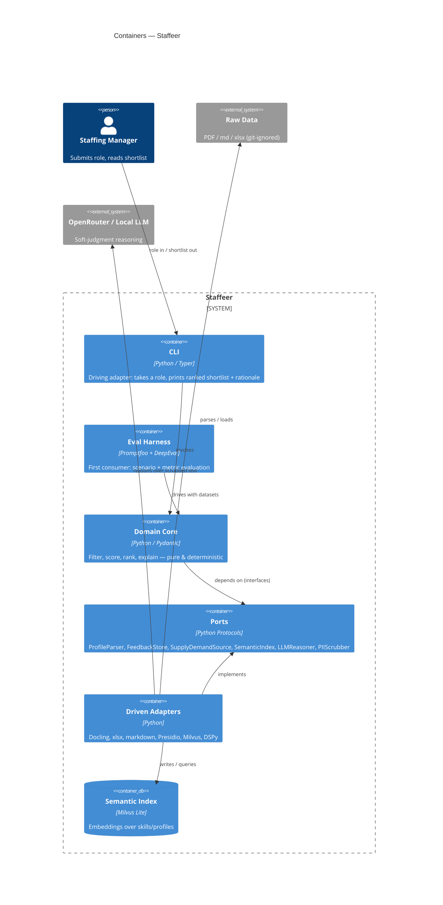

# L2 — Containers

> **Canonical model:** the architecture is defined in LikeC4 at `docs/architecture/model.staffeer.c4` (views `context` / `containers`). The Mermaid diagram below is a rendered mirror — keep it in sync with the `.c4` model when the architecture changes (see `.claude/rules/likec4.md`).

Staffeer is a single Python application (a CLI plus an eval harness), not a distributed
system. The "containers" here are the deployable/runnable units and the major internal
boundaries that matter for how the code is organized and tested.

## Runnable units

- **CLI (`staffeer` / `src/staffeer/cli/`)** — Typer app. Driving adapter. Accepts a free-text
  role (`"backend engineer with database experience"`) or a role id from the sheet, invokes
  the domain core, and renders the ranked, explained shortlist to the terminal.
- **Eval harness (`evals/`)** — Promptfoo + DeepEval. The *first* consumer. Drives the same
  core with curated datasets (including negative cases) and scores relevance/faithfulness.

## Internal boundaries (hexagonal)

- **Domain core (`src/staffeer/domain/`)** — pure, deterministic. Models, hard-constraint
  filtering, scoring, ranking, explanation assembly. No I/O, no third-party clients.
- **Ports (`src/staffeer/ports/`)** — the interfaces the core depends on: `ProfileParser`,
  `FeedbackStore`, `SupplyDemandSource`, `SemanticIndex`, `LLMReasoner`, `PIIScrubber`.
- **Driven adapters (`src/staffeer/adapters/`)** — concrete implementations:
  - Docling → parse profile PDFs
  - openpyxl/pandas → load `demand-supply.xlsx`
  - markdown loader → project feedback
  - Presidio + spaCy → PII scrubbing (runs before any LLM call)
  - Milvus Lite → embed + semantically retrieve over skills/profiles
  - DSPy over OpenRouter (or local model) → soft-judgment reasoning

## Pipeline

`ingest → scrub PII → enrich/index → filter (hard constraints) → score → rank → explain`

The first vertical slice runs this against **beach-only** supply. Hard constraints (location,
start date) are deterministic; scoring soft factors (skills incl. adjacency, feedback,
availability) may call the LLM, with all reasoning surfaced for explainability.

## Diagram

