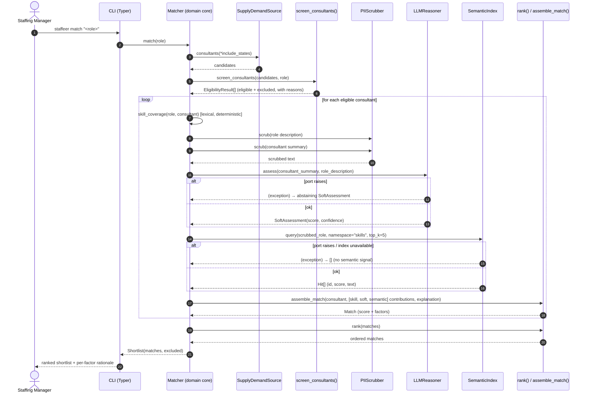
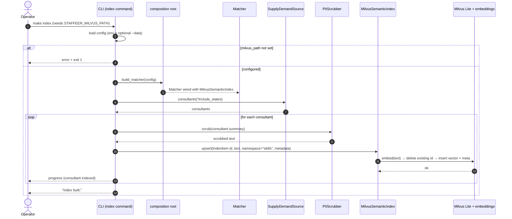

# L3 — Matching & Indexing sequences

> **Canonical model:** the static architecture is defined in LikeC4 at
> `docs/architecture/model.staffeer.c4` (views `context` / `containers`); see
> [`L1-system-context.md`](L1-system-context.md) and [`L2-containers.md`](L2-containers.md).
> The dynamic (runtime) sequences below mirror the behaviour of `Matcher` in
> `src/staffeer/domain/matcher.py` and the `index` command in `src/staffeer/cli/main.py` —
> keep them in sync with that code when the pipeline changes (see `.claude/rules/likec4.md`).

These two flows show *how* the hexagonal pieces collaborate at runtime. The domain core (`Matcher`)
only ever calls **ports**; the concrete adapters (Milvus, Presidio, DSPy) sit behind those ports.
PII is scrubbed before any text reaches the semantic index or the LLM.

## 1. Match a role → ranked, explained shortlist

Per eligible consultant, the matcher blends three signals into the score —
**lexical skill coverage** (deterministic), **LLM soft judgment**, and **semantic similarity** —
and surfaces each as an explanation factor. The LLM and semantic ports are wrapped: a port failure
degrades to an abstaining assessment / empty hits rather than aborting the match.

## 2. Build the semantic index (`staffeer index` / `make index`)

`MilvusSemanticIndex` is only wired when `semantic_enabled` **and** `milvus_path` are set;
otherwise the composition root returns `NullSemanticIndex` (with a warning) and this command exits
early. Every consultant summary is PII-scrubbed before it is embedded and upserted; `upsert` is
idempotent on `id`, so re-running the build is safe.

## Notes

- **Determinism boundary.** Hard-constraint screening (`screen_consultants`) and lexical
  `skill_coverage` are fully deterministic; only the LLM and semantic signals are variable, and
  both are surfaced as explanation factors so a recommendation is never unexplained.
- **Fail-soft soft signals.** A failing `LLMReasoner` or `SemanticIndex` never aborts a match —
  the matcher degrades to an abstaining assessment / empty hits. Adapter-level infrastructure
  errors are mapped to `SemanticIndexError` at the boundary (hexagonal error mapping).
- **PII before embedding/LLM.** Both flows scrub text via `PIIScrubber` before it reaches the
  semantic index or the LLM (Principle 5 — secure & governed).
